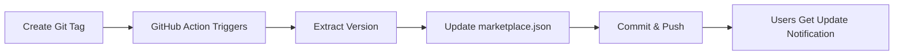

# 🎪 Marketplace Automation Setup

This document explains how to set up automatic marketplace updates when releasing new plugin versions.

## 🔧 GitHub Token Setup (One-time)

### 1. Create Personal Access Token
1. Go to: https://github.com/settings/personal-access-tokens/new
2. **Token name**: `Mysios Labs Marketplace Updater`
3. **Expiration**: 1 year (set reminder to renew)
4. **Repository access**: Select repositories
   - ✅ `Mysios-Labs-inc/claude-jobseeking-plugin`
   - ✅ `Mysios-Labs-inc/claude-plugins-marketplace`

### 2. Token Permissions
**Repository permissions:**
- ✅ **Contents**: Write (to update files)
- ✅ **Metadata**: Read (to access repository info)
- ✅ **Pull requests**: Write (if needed for reviews)

### 3. Add Token to Repository Secrets
1. Go to: https://github.com/Mysios-Labs-inc/claude-jobseeking-plugin/settings/secrets/actions
2. Click **New repository secret**
3. **Name**: `MARKETPLACE_TOKEN`
4. **Secret**: Paste your personal access token
5. Click **Add secret**

## 🚀 How It Works

### Automated Workflow


### Trigger Commands
```bash
# Create and push a new version tag
git tag v1.0.1 -m "Release v1.0.1: Enhanced document upload"
git push --tags

# 🤖 GitHub Action automatically:
# 1. Detects the new tag
# 2. Updates marketplace.json with new version
# 3. Commits changes to marketplace repo
# 4. Users see update notification in Claude Code
```

### What Gets Updated
```json
// marketplace.json - BEFORE
{
  "plugins": [{
    "name": "jobseeking-plugin",
    "version": "1.0.0",
    "source": {
      "source": "github",
      "repo": "Mysios-Labs-inc/claude-jobseeking-plugin",
      "ref": "v1.0.0"
    }
  }]
}

// marketplace.json - AFTER (automated)
{
  "plugins": [{
    "name": "jobseeking-plugin",
    "version": "1.0.1",  // ← Updated
    "source": {
      "source": "github",
      "repo": "Mysios-Labs-inc/claude-jobseeking-plugin",
      "ref": "v1.0.1"  // ← Updated
    }
  }]
}
```

## ✅ Test the Automation

### Test Release (Safe)
```bash
# Create a test tag to verify automation works
git tag v1.0.0-test -m "Test automation"
git push --tags

# Check GitHub Actions tab for workflow execution
# Verify marketplace.json was updated correctly
# Delete test tag after verification:
git tag -d v1.0.0-test
git push origin :refs/tags/v1.0.0-test
```

## 🔍 Troubleshooting

### Action Fails with "Permission denied"
- Verify `MARKETPLACE_TOKEN` secret exists
- Check token permissions include "Contents: Write"
- Ensure token hasn't expired

### marketplace.json Not Updated
- Check workflow logs in GitHub Actions tab
- Verify jq command syntax in workflow
- Ensure marketplace repo structure is correct

### Users Don't See Updates
- Verify marketplace.json version was actually updated
- Users need to run `/plugin marketplace update` to refresh
- Check Claude Code plugin cache refresh timing

## 🔄 Release Workflow

### Your New Process
1. **Develop** → Make changes to plugin code
2. **Test** → Verify changes work locally
3. **Commit** → Push changes to main branch
4. **Release** → Create version tag: `git tag v1.0.1 && git push --tags`
5. **Automated** → GitHub Action updates marketplace
6. **Notify** → Users get update notification in Claude Code

### Version Numbering
- **Major**: `v2.0.0` - Breaking changes, new major features
- **Minor**: `v1.1.0` - New features, backwards compatible
- **Patch**: `v1.0.1` - Bug fixes, small improvements

## 🎯 Benefits

- ✅ **Zero Manual Work** - Tag and push, automation handles the rest
- ✅ **Instant Distribution** - Users get updates immediately
- ✅ **Version Sync** - Plugin and marketplace always in sync
- ✅ **Professional** - Automated release notes and consistent formatting
- ✅ **Scalable** - Add more plugins to same marketplace easily

## 📞 Support

If automation fails or needs adjustment:
1. Check GitHub Actions logs
2. Verify token permissions
3. Test with a patch release
4. Contact: hello@mysioslabs.com